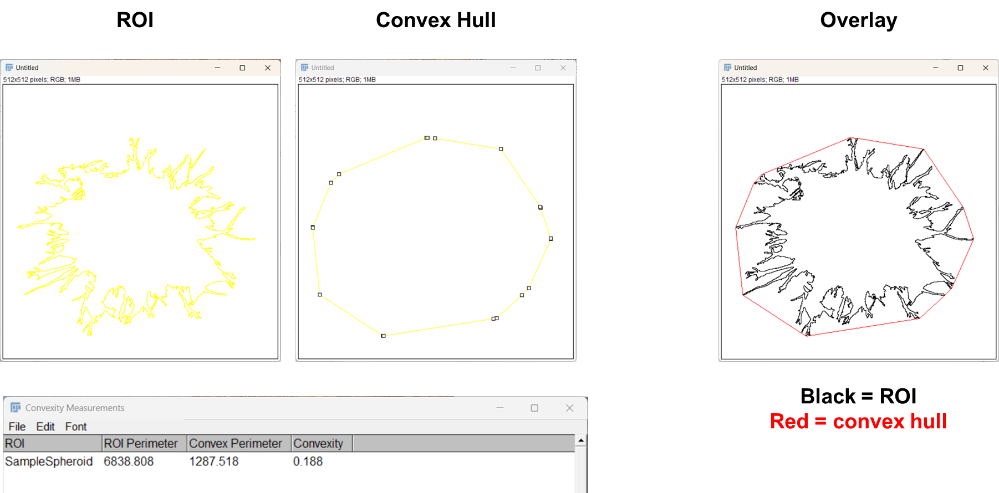

# FIJI-Spheroid-Morphological-Signatures
FIJI macros as featured in the manuscript **Shape Factor Analysis as a Quantitative Framework for Assessing Spheroid and Organoid Morphology and Invasiveness**

Code DOI: 10.5281/zenodo.18881209 
## Overview 
This repository contains several macros used in shape factor analysis of spheroids. 
* [The convexity macro](#convexity-background-and-usage) stands alone in calculating the shape factor convexity for ROI(s) in FIJI. 

* [The perimeter points calculator and the interpolation macro](#perimeter-points-and-interpolation) are useful for preparing ROIs for the [MATLAB radial length analysis](https://github.com/BrittanySchutrum/AverageRadialLegnthCrossings-Spheroids) also featured our manuscript. These macros are not required for editing the ROIs for radial length analysis but are useful for the applications we describe.
   
## Description and Installation 
The macros here were developed and tested in the [FJIJ](https://fiji.sc/) version of ImageJ (FIJI 2.16.0/1.54p). FIJI is built on ImageJ2 and comes with plugins. FIJI can be downloaded from [https://fiji.sc/](https://fiji.sc/) . Please see [https://github.com/fiji](https://github.com/fiji) for additional information 
 
### FIJI (Image J) Macros in this repository 
1) [ConvexityMacro.ijm](https://github.com/BrittanySchutrum/FIJI-Spheroid-Morphological-Signatures/blob/main/ConvexityMacro.ijm) = calculates the convexity (the convex perimeter divided by the perimeter) for each ROI open in the ROI manager 
2) [perimeter_points.ijm](https://github.com/BrittanySchutrum/FIJI-Spheroid-Morphological-Signatures/blob/main/perimeter_points.ijm) = counts the number of perimeter points defining an ROI. Useful in preparing ROIs for radial length analysis in MATLAB
3) [interpolation.ijm](https://github.com/BrittanySchutrum/FIJI-Spheroid-Morphological-Signatures/blob/main/Interpolation.ijm) = creates additional perimeter points to define an ROI by interpolating to a 1 pixel interval. Useful for preparing ROIs for radial length analysis in MATLAB

.ijm files can be downloaded and opened directly in FIJI

## Convexity Background and Usage 
Convexity is a dimensionless shape factor that is defined by the convex perimeter divided by the original shape perimeter. Convex hull is a function in FIJI that makes a selected region convex.

### ConvexityMacro.ijm
**Inputs:** ROI set (or single ROI)

**Outputs:**  
1. ROIs of the convex hulls for each ROI 
2. A table containing the perimeters, convex perimeters, and convexity measurements for each ROI 

## Perimeter Points and Interpolation 
### Background and useage 
Radial length analysis (RLA) of spheroids in MATLAB as described in the repository [AverageRadialLengthCrossings-Spheroids](https://github.com/BrittanySchutrum/AverageRadialLegnthCrossings-Spheroids) is dependent on the coordinates of points which define the perimeter of an ROI created in FIJI. By default, the shape is defined by the minimum number of points to define the shape in FIJI, however for RLA applications it is desirable to interpolate the perimeter points to maximize the number of defined points. 

### Perimeter_points.ijm
**Inputs:**
1. ROI set
2. A blank image to project the ROIs onto. NOTE: this must be of sufficient pixel dimensions to fit your ROIs. To create, in FIJI go to File > New Image  and specify dimensions. 

**Output:**  log listing each ROI and the corresponding number of perimeter points

### Interpolation.ijm
**Inputs:**
1. ROI set
2. A blank image to project the ROIs onto. NOTE: this must be of sufficient pixel dimensions to fit your ROIs. To create, in FIJI go to File > New Image  and specify dimensions. 

**Output:** updated ROI manager with each ROI interpolated to a 1-pixel interval.

## Authors
Primary code development: Brittany Schutrum, Jenny Deng, Amalie Gao, Emily Hur, Ju Hee Kim

## Author Contact Information 
### Brittany Schutrum 
**ORCID**: [0000-0002-4462-7812](https://orcid.org/0000-0002-4462-7812) 
**Institution**: Cornell University 
**Emial**: bs773(at)cornell.edu

### Claudia Fischbach 
**ORCID**: [0000-0002-9368-0150](https://orcid.org/0000-0002-9368-0150) 
**Institution**: Cornell University 
**Emial**: cf99(at)cornell.edu

